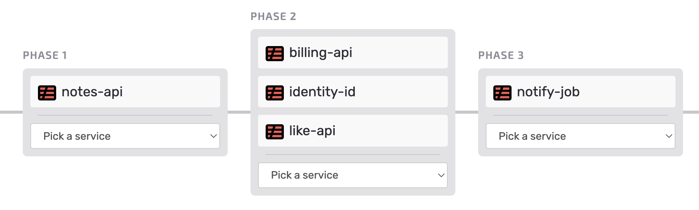

## Backend [SST guide](https://sst.dev/guide.html)

This implementation is based on an SST guide extended version which included chapters "Best Practices" and "Extra Credit". 

Actually the backend consists of:

* [Infrastructure](https://github.com/s4nt14go/serverless-stack-ext-resources): Deploys S3, DynamoDB & Cognito, it doesn't change a lot and can be shared between several Serverless API stages. It uses [AWS CDK](https://aws.amazon.com/cdk) with [SST](https://github.com/serverless-stack/serverless-stack) for deployment.
* [API](https://github.com/s4nt14go/serverless-stack-ext-api) (this repo): Deploys API Gateway and Lambdas, most of the development iterations are done on this repo. It uses [Serverless Framework](https://github.com/serverless/serverless) for deployment.

For the frontend and the demo link check [this repo](https://github.com/s4nt14go/serverless-stack-client)

## Instructions:

Node version 14 used for development, using [nvm](https://github.com/nvm-sh/nvm) you can:
```
# set Node 14 in current terminal
nvm use 14
# set Node 14 as default (new terminals will use 14)
nvm alias default 14
```

For deployment, you need to deploy first [Infrastructure](https://github.com/s4nt14go/serverless-stack-ext-resources) and then respect this order:
<br />
<p align="center">
    
</p>
<br />

If deploying is handled by [seed](https://seed.run), it will detect the `serverless.yml` files in each folder and deploy them in the selected order. If you want to make the deployment by yourselves for development, do as follows. 

Install dependencies and deploy `services/notes-api`:  
```
cd services/notes-api
npm ci
npm run deploy
```

Install dependencies and deploy `services/billing-api`:
```
cd services/billing-api
npm ci
npm run deploy
```

Deploy `services/identity-id`:
```
cd services/identity-id
npm run deploy
```

Deploy `services/like-api`:
```
cd services/like-api
npm run deploy
```

Deploy `services/notify-job`:
```
cd services/notify-job
npm run deploy
```

> For the cleanup, delete the serverless projects in reverse order.